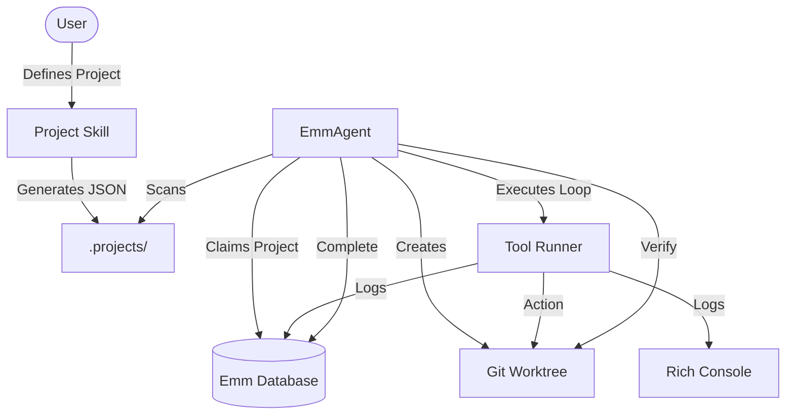

# Emm: Parallel AI Agent Orchestrator

**Emm** is a specialized autonomous agent runtime designed for executing long-running, iterative coding tasks. It operates by claiming "Projects" from a central database and executing them through an isolated, parallel architecture.

## 🚀 Key Features

- **Isolated Execution**: Every session runs in its own Git worktree, ensuring clean environments and preventing cross-agent interference.
- **Atomic Persistence**: SQLite-backed persistence using WAL mode and `BEGIN IMMEDIATE` transactions for robust concurrency.
- **Rich CLI**: Comprehensive suite of commands for running agents, managing tasks, and inspecting system state.
- **Dual Logging**: Real-time rich console feedback combined with persistent database logging for every iteration.
- **Intelligent Recovery**: Ability to resume interrupted sessions from the last known state.

## 🏗 System Architecture

Emm follows a modular architecture where the central controller manages the lifecycle of an agent session, from claiming work to task verification.



## 🛠 Usage

### Ingesting Projects
Place your JSON project definitions in the `.projects/` directory. The agent will automatically ingest these when starting a new session.

### Running the Agent
By default, the agent runs in **Continuous Mode**, claiming and executing projects until the database is empty.

```bash
# Start the agent (processes all pending projects)
python3 -m emm.cli run

# Run only a single project and exit
python3 -m emm.cli run --once

# Resume the last incomplete session
python3 -m emm.cli run --resume

# Run with custom max iterations per task
python3 -m emm.cli run 20
```

### Resource Management
List and inspect the current state of the system:
```bash
# List all ingested projects
python3 -m emm.cli list projects

# List all sessions and their status
python3 -m emm.cli list sessions

# List tasks for the current project
python3 -m emm.cli list tasks
```

### Maintenance
Identify and remove orphaned worktrees from crashed or interrupted sessions:
```bash
python3 -m emm.cli cleanup --dry-run
python3 -m emm.cli cleanup
```

## 📂 Project Structure

- `emm/`: Core package containing the agent logic.
  - `core.py`: Main agent runtime and execution loop.
  - `database.py`: SQLite persistence layer and migrations.
  - `git_utils.py`: Worktree and branch management.
  - `logger.py`: Console and DB logging handlers.
  - `runners.py`: AI tool execution interface.
- `.projects/`: Source of truth for project definitions (JSON).
- `worktrees/`: Isolated directories for active session execution.
- `scripts/data/`: Default location for `emm.db`.

## 🧪 Development

### Running Tests
Emm uses the standard `unittest` framework:
```bash
python3 -m unittest discover tests
```

### Code Quality
We use `ruff` for linting and formatting:
```bash
ruff check .      # Lint
ruff format .     # Format
```

### Database Migrations
Migrations are stored in `emm/migrations/`. The database runner automatically applies pending `.sql` files on startup.

---
**Status: Alpha / Pre-launch**. Schema stability is not guaranteed.
